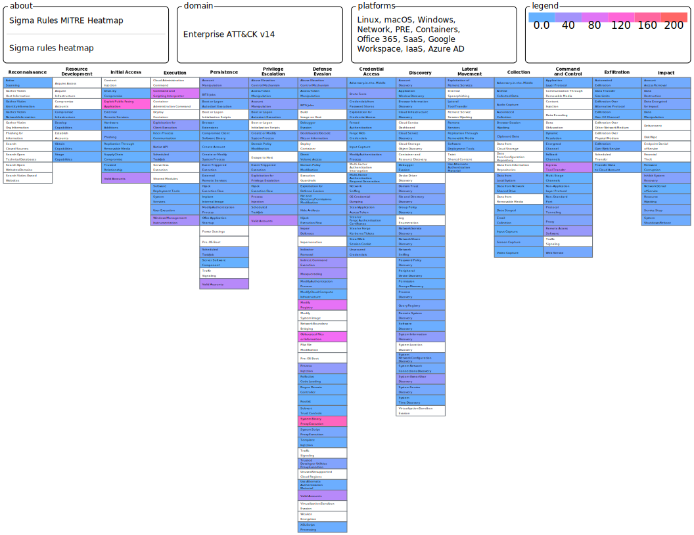

# Sigma rules MITRE Heat Map 

Very Simple reimplementation of  [Sigma2Attack.py](https://github.com/SigmaHQ/legacy-sigmatools/blob/1a0f514f19f5b9228e7b0a7f05acdf28c7436194/tools/sigma2attack) with pysigma

Basic Use : `python sigma-mitre.py sigma\rule*`

Sigma2attack options:
- [X] --rules-directory : Directory to read rules from
- [X] --out-file : File to write the JSON layer to
- [X] --no-comment : Don't store rule names in comments
- [X] --status-start : Check rule with minimun status
- [X] --status-end : Check rule with maximun status
- [ ] --level-score : Score depand form rule level

sigma-mitre options:
- --output-name : Name of the HeatMap json file
- --force-update : Force Internet MITRE update.
- --color-min : Min color '#RRGGBBAA'
- --color-middle : Middle color '#RRGGBBAA'
- --color-max : Max color '#RRGGBBAA'
- --no-sigma-name: Do not put sigma rule name in the metadata
- --no-mitre-description: Do not put mitre description in comment
- --status-min : Minimun status of a rule
- --status-max : Maximun status of a rule
  
Need the sigma rule folder as INPUT

Default color result:

